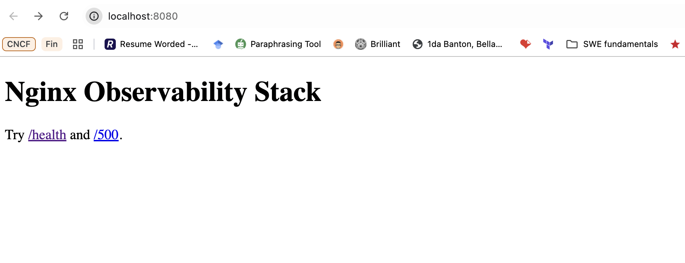
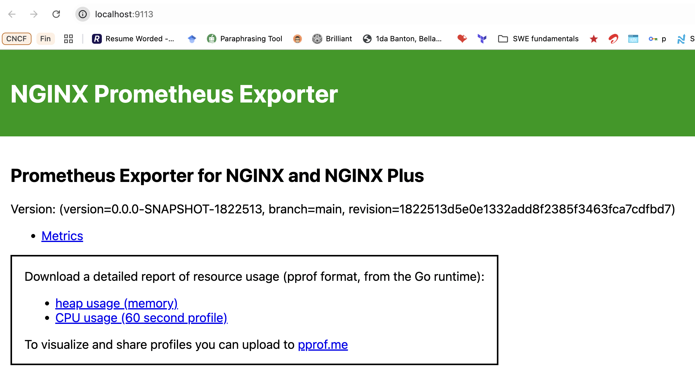
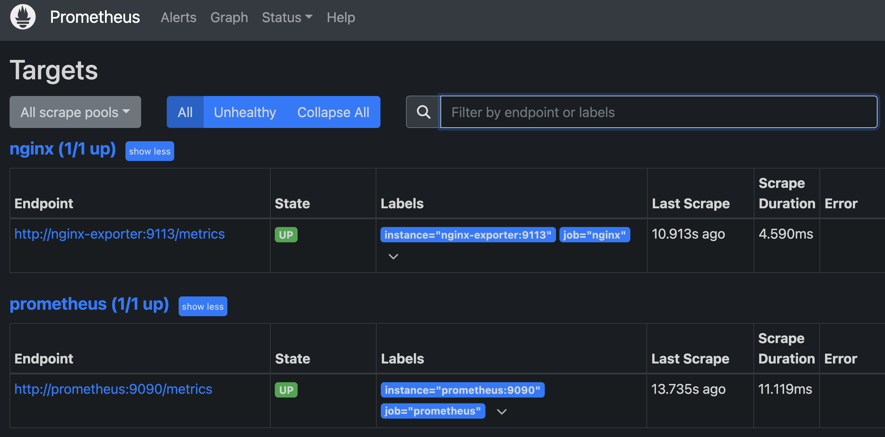
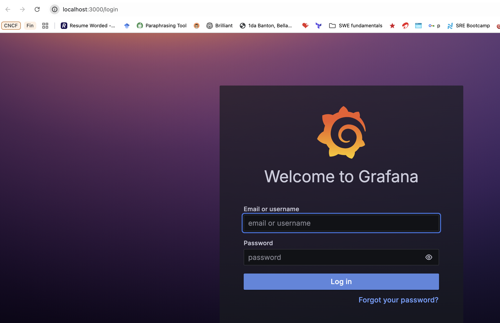
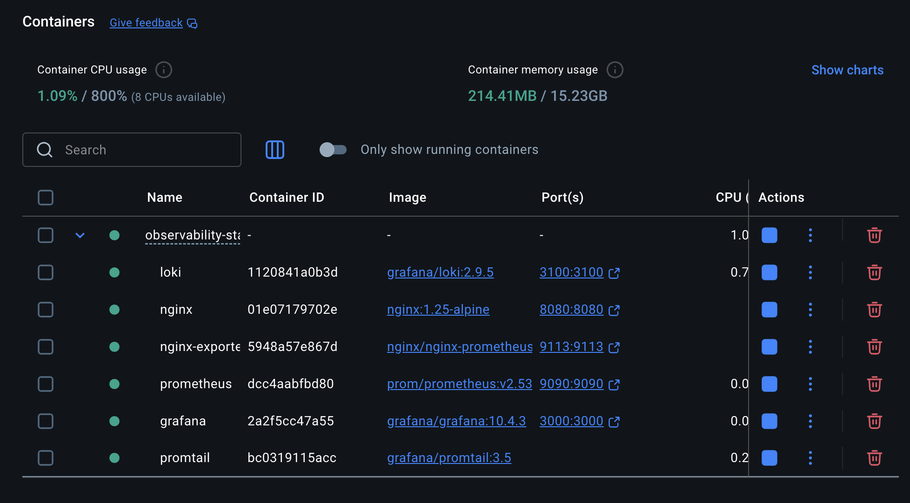
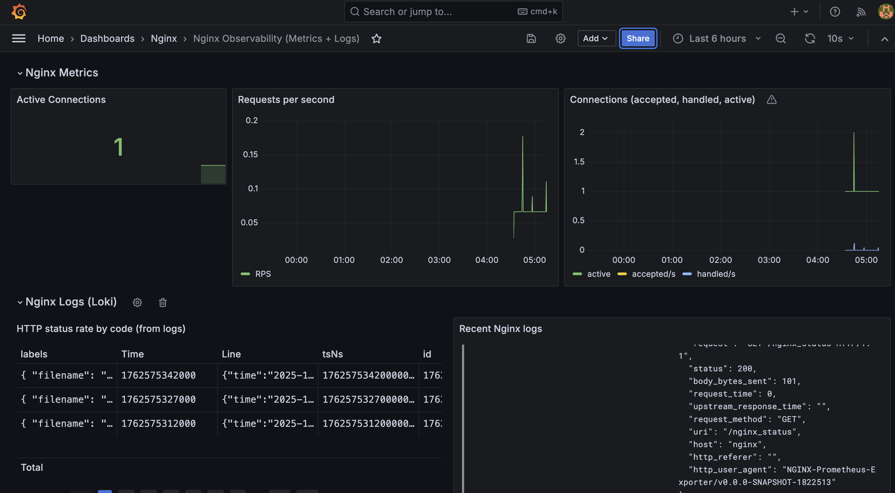
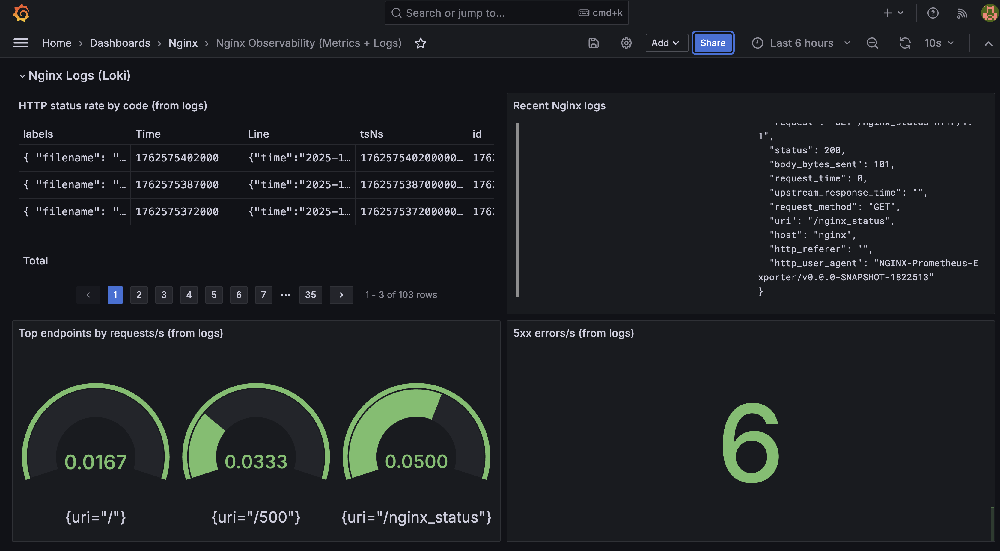
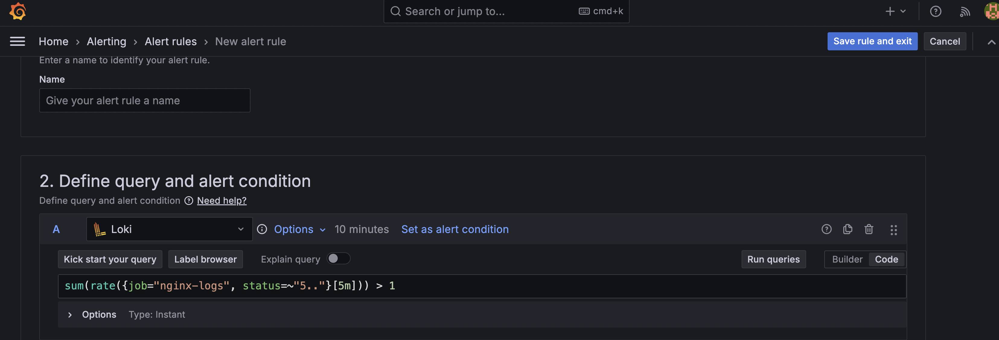

# observability-stack-with-docker-compose

Scenario: An existing web server is experiencing intermittent performance issues, but the team lacks visibility into its operations. This repo shows how to deploy an observability stack using Docker Compose to monitor the web server.

## Run the application

```bash
docker compose up -d
```

## Access the services via

- [Grafana](http://localhost:3000) (default login details)
- [Prometheus](http://localhost:9090)
- [Nginx](http://localhost:8080)
- [Loki](http://localhost:3100)

## Generate traffic/errors

```bash
curl -s http://localhost:8080/health
ab -n 1000 -c 50 http://localhost:8080/   # or hey -z 30s -c 10
curl -s -o /dev/null -w "%{http_code}\n" http://localhost:8080/500
```

## Dashboard & alerts setup

### Panels

Panels were built for each monitoring tool. There's Prometheus for metrics and Loki for logs.

- **Prometheus** shows active connections, requests/sec, connections accepted/handled.

- **Loki**: HTTP status rates by code, recent logs, top endpoints, 5xx errors/sec.

### Alerts

An alert was setup to notify engineers whenever there is a high rate of 5xx error from the website. This was setup using a Loki query.

`sum(rate({job="nginx-logs", status=~"5.."}[5m])) > 1 for 5 minutes`

## Visuals










## Components

### Nginx (web server)

- Serves traffic on :8080.
- Exposes a lightweight text endpoint /nginx_status (stub_status) for connections/request counters.
- Emits JSON access logs (and error logs) to `/var/log/nginx/*`

### nginx-prometheus-exporter (metrics adapter)

- Scrapes `http://nginx:8080/nginx_status`.
- Translates those counters into Prometheus metrics like `nginx_connections_active`, `nginx_http_requests_total`, etc.

### Prometheus (metrics DB + scraper)

- Periodically scrapes the exporter (not Nginx directly).
- Stores time series and serves PromQL to Grafana.

### Promtail (log shipper)

- Tails Nginx log files via a shared Docker volume (nginx_logs).
- Parses each line as JSON, extracts fields (status, uri, method, host, time, request_time) and attaches them as labels/values.
- Pushes labeled log streams to Loki.

### Loki (log database)

- Stores logs as streams (labels + entries).
- Supports LogQL for queries, filtering, rates, and aggregations (e.g., `sum(rate({job="nginx-logs",status=~"5.."}[5m]))`).

### Grafana (visualization)

- Connect to the pre-provisioned datasources: Prometheus (metrics) + Loki (logs).
- Loads a ready dashboard that shows golden-signal metrics and log analytics on one page.
- Hosts a Grafana alert rule that evaluates a Loki query to detect elevated 5xx rates.

## Architecture

```
                     HTTP clients
                          |
                          v
+-------------------------+-------------------------+
|                         Nginx                     |
|  :8080 (/, /health, /500)                         |
|  writes JSON access/error logs -> /var/log/nginx  |
|  exposes /nginx_status (stub_status)              |
+-------------------------+-------------------------+
                          |  (stub_status)
                          v
                +---------+----------+
                | nginx-prometheus   |
                |     -exporter      |
                +---------+----------+
                          |  scraped by
                          v
                    +-----+-----+
                    | Prometheus|
                    +-----+-----+
                          |
                          v
                    +-----+-----+
                    |  Grafana  | visualization
                    +-----+-----+
                       ^     ^
   logs (push)         |     |  metrics (read)
                       |     |
+----------------------+     +----------------------+
|                   Promtail                       |
|  tails nginx_logs volume, parses JSON, labels    |
+----------------------+---------------------------+
                       |
                       v
                  +----+----+
                  |  Loki   |
                  +---------+
```

**Note**:

- Metrics path is pull (Prometheus scrapes exporter).
- Logs path is push (Promtail pushes to Loki).
- Grafana sits on top and correlates both via labels/time.


